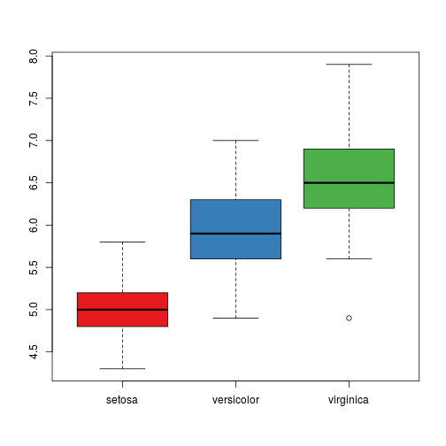
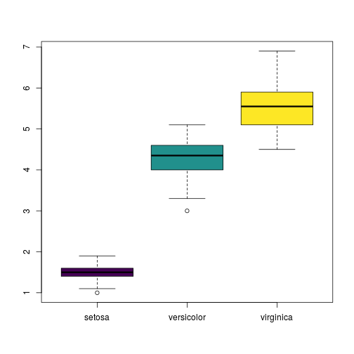

## Read-And-Delete

1. Edit YAML front matter
2. Write using R Markdown
3. Use an empty line followed by three dashes to separate slides!

--- .class #id 

## Slide 2

 

```r
library(RColorBrewer)
with(iris, boxplot(Sepal.Length~Species,col=brewer.pal(3,"Set1")))
```



---

## Slide 3


```r
library(viridis)
with(iris, boxplot(Petal.Length~Species,col=viridis(3)))
```




